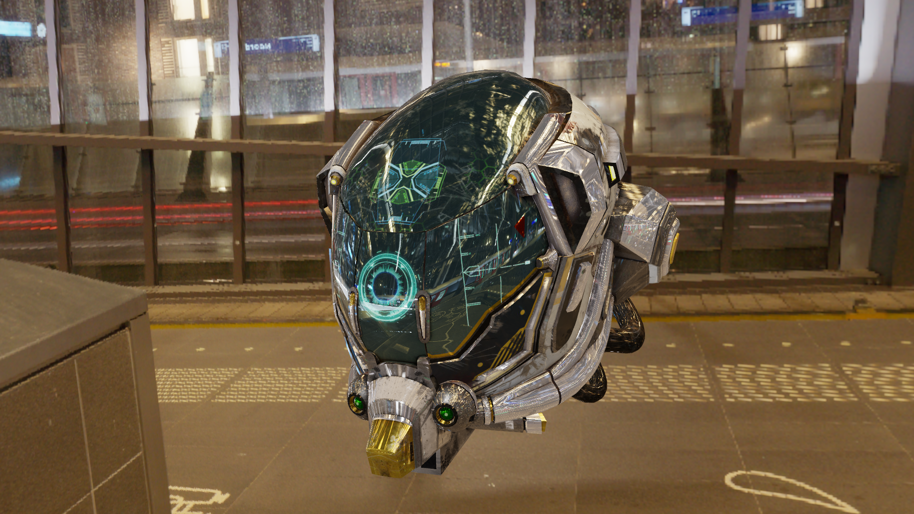

[](https://choosealicense.com/licenses/bsd-3-clause/)

# panda3d-simplepbr

A straight-forward, easy-to-use PBR render pipeline for [Panda3D](https://www.panda3d.org/).
This project aims to be a drop-in replacement for Panda3D's auto-shader.
The PBR shader is heavily inspired by the [Khronos glTF Sample Viewer](https://github.com/KhronosGroup/glTF-Sample-Viewer).
*Note:* this project does not make an attempt to match a reference renderer.



## Features
* Supports running on a wide range of hardware with an easy OpenGL 2.1+ requirement
* Forward rendered metal-rough PBR
* All Panda3D light types (point, directional, spot, and ambient)
* Filmic tonemapping 
* Normal maps
* Emission maps
* Occlusion maps
* Basic shadow mapping for DirectionalLight and Spotlight
* Post-tonemapping color transform via a lookup table (LUT) texture
* IBL diffuse and specular

## Installation

Use pip to install the `panda3d-simplepbr` package:

```bash
pip install panda3d-simplepbr
```

To grab the latest development build, use:

```bash
pip install git+https://github.com/Moguri/panda3d-simplepbr.git
```

## Documentation

More detailed documentation can be found [here](https://moguri.github.io/panda3d-simplepbr/).

## Usage

Just add `simplepbr.init()` to your `ShowBase` instance:

```python
from direct.showbase.ShowBase import ShowBase

import simplepbr

class App(ShowBase):
    def __init__(self):
        super().__init__()

        simplepbr.init()
```

The `init()` function will choose typical defaults.
Details on available options can be found [here](https://moguri.github.io/panda3d-simplepbr/config/)

## Example

For an example application using `panda3d-simplepbr` check out the [viewer](https://github.com/Moguri/panda3d-gltf/blob/master/gltf/viewer.py) in the [panda3d-gltf repo](https://github.com/Moguri/panda3d-gltf).


## Developing

This project uses [uv](https://docs.astral.sh/uv/) for project management.
After installing `uv`, run `uv sync` to install dependencies and create a virtual environment.

### Linting

This project uses [ruff](https://docs.astral.sh/ruff/) for linting.
Running lint checks can be done with:

```bash
uv run ruff check
```

### Running Tests

```bash
uv run pytest
```

### Building Wheels

```bash
uv run build
```

## License
[B3D 3-Clause](https://choosealicense.com/licenses/bsd-3-clause/)
