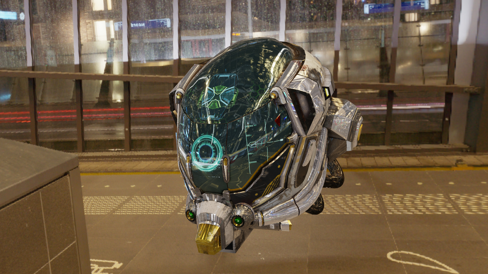

A straight-forward, easy-to-use PBR render pipeline for [Panda3D](https://www.panda3d.org/).
This project aims to be a drop-in replacement for Panda3D's auto-shader.

## Features
* Supports running on a wide range of hardware with an easy OpenGL 2.1+ requirement
* Forward rendered metal-rough PBR
* All Panda3D light types (point, directional, spot, and ambient)
* Filmic tonemapping 
* Normal maps
* Emission maps
* Occlusion maps
* Basic shadow mapping for DirectionalLight and Spotlight
* Post-tonemapping color transform via a lookup table (LUT) texture
* IBL diffuse and specular
